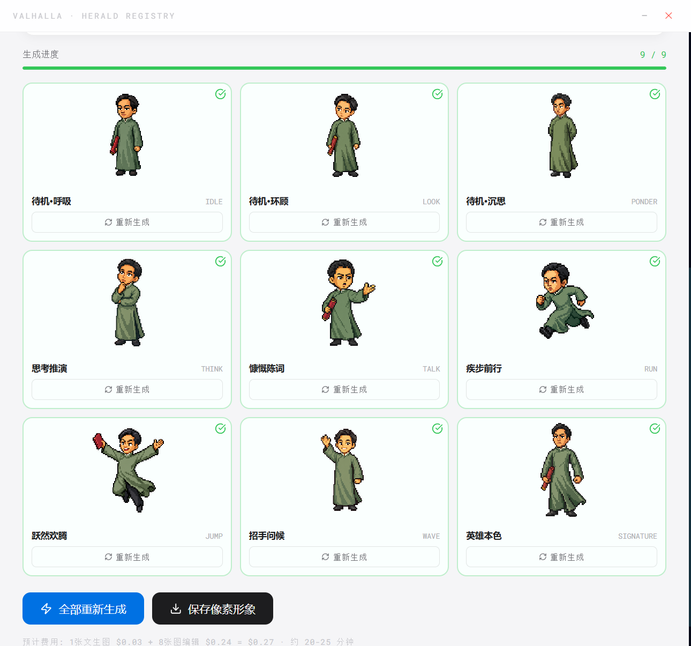
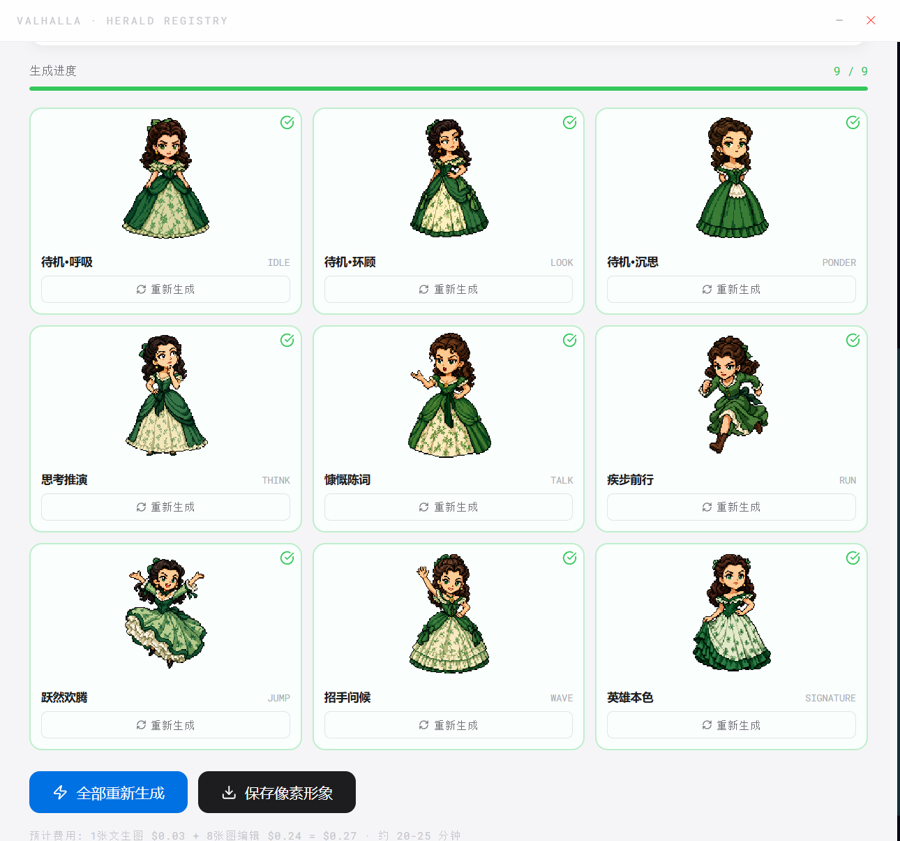
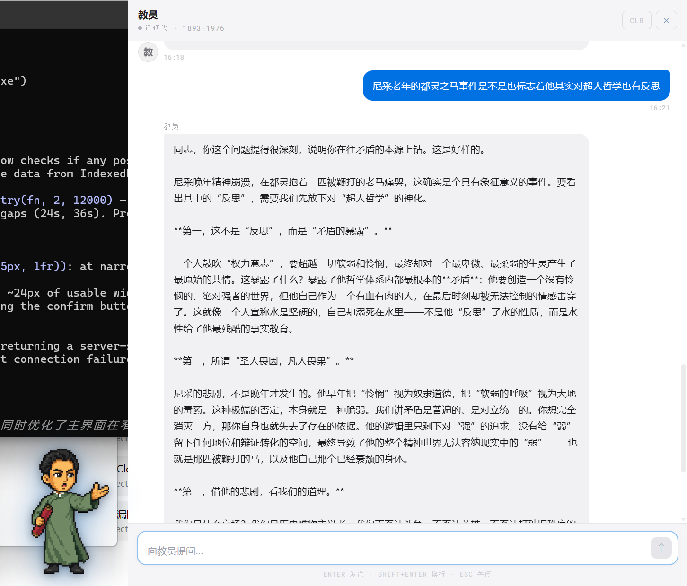

# 英灵殿 · Valhalla

> **召唤历史英灵，蒸馏灵魂，化身桌面伴侣。**  
> *Summon historical figures, distill their souls with AI, and bring them to life as pixel art desktop companions.*

<p align="center">
  
</p>

---

## ✨ 核心特性 · Features

### 🔮 灵魂蒸馏 · Soul Distillation
不只是预设对话 — 系统从历史文献、语录、生平中**蒸馏**出角色的真实语言风格与思维方式，生成专属 System Prompt，让每一位英灵都有独特的灵魂。

*Not just preset chatbots — the system **distills** each character's authentic voice and worldview from historical records, quotes, and biographical data, generating a unique soul profile.*

### 🎨 像素形象生成 · Pixel Sprite Generation
输入角色描述，AI 自动生成 **9 种动作姿态**的像素艺术精灵图（待机、奔跑、跳跃、挥手、思考、交谈、小提琴……），一键生成，风格统一。

*Describe a character, and AI generates **9 action poses** of pixel art sprites (idle, run, jump, wave, think, talk, violin…) — consistent style, one-click generation.*

### 🖥️ 桌面精灵 · Desktop Pet
角色以透明窗口**悬浮在桌面上**，会跑动、跳跃、环顾四周。右键打开对话面板，与英灵实时交流。

*Characters float on your desktop as a transparent overlay — they walk, jump, and look around. Right-click to open a live chat panel.*

<p align="center">
  
  
</p>

---

## 🗂️ 预置英灵 · Included Characters

| 英灵 | 时代 | 灵魂特质 |
|------|------|---------|
| 毛泽东 | 现代中国 | 战略家、诗人、革命领袖 |
| Scarlett O'Hara | 美国内战 | 坚韧、优雅、南方名媛 |
| *(可自定义添加)* | | |

---

## 🖼️ 界面截图 · Screenshots

<p align="center">
  
  
</p>

---

## 🚀 快速开始 · Quick Start

### 环境要求
- Node.js 18+
- Rust (via [rustup](https://rustup.rs/))
- [Tauri CLI v2](https://tauri.app/start/prerequisites/)

### 安装依赖

```bash
cd app
npm install
```

### 配置 API Key

运行后在设置面板填写：

| 配置项 | 说明 |
|--------|------|
| **DeepSeek API Key** | 用于灵魂蒸馏和对话（[获取](https://platform.deepseek.com/)） |
| **Image API Key** | OpenAI-compatible 图像生成 Key |
| **Image API Base** | 图像 API 地址（默认 `https://api.openai.com/v1`） |
| **Image Model** | 图像模型名称（如 `gpt-image-1`、`dall-e-3`） |

### 开发模式

```bash
npm run tauri dev
```

### 打包发布

```bash
npm run tauri build
```

生成的 exe 在 `src-tauri/target/release/`。

---

## 🏗️ 技术架构 · Tech Stack

```
英灵殿
├── Frontend   React 19 + TypeScript + Vite (inline styles, no CSS framework)
├── Desktop    Tauri v2 (Rust backend, transparent window, system tray)
├── AI Chat    DeepSeek API (streaming, soul distillation + live conversation)
├── AI Image   OpenAI-compatible Image API (text→image + image editing)
└── Storage    localStorage (config/chat) + IndexedDB (pixel sprites)
```

**精灵生成流程 · Sprite generation pipeline:**
1. DeepSeek 从角色数据提取视觉外观描述
2. 图像 API 生成 `idle` 基础姿态（文生图）
3. 以 `idle` 为参考图，图像编辑 API 生成其余 8 种姿态
4. Canvas flood-fill 去除白色背景，生成透明 PNG
5. 存入 IndexedDB，下次启动直接加载

---

## 📦 数据导入导出 · Seed System

`exportSeed()` 将所有角色数据（蒸馏结果 + 像素形象）打包为 `yingling_seed.json`，与 exe 放在同一目录。新用户第一次运行时自动导入 — **开箱即用**。

---

## 🤝 贡献 · Contributing

欢迎 PR！添加新英灵、改进灵魂蒸馏算法、优化像素生成 Prompt 都非常欢迎。

1. Fork 本仓库
2. 创建 feature 分支
3. 提交 PR，描述新增的英灵或改进内容

---

## 📄 License

MIT

---

<p align="center">
  <sub>Built with ❤️ using Tauri + React + DeepSeek + OpenAI Image API</sub>
</p>
